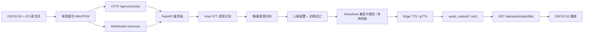

# ESP32-S3 语音机器人架构设计

本文档描述 ESP32-S3 语音机器人从硬件采集、服务端识别、情绪和人格处理、大模型回复、语音合成到播放的整体架构。当前项目已经具备服务端核心链路，后续重点是持久化记忆、ESP32-S3 固件联调和实时体验优化。

## 1. 总体目标

机器人需要形成一条完整闭环：

1. ESP32-S3 通过 I2S 麦克风采集用户语音。
2. ESP32-S3 将音频上传到服务端。
3. 服务端把音频转成文字。
4. 服务端分析情绪、读取人格和近期记忆。
5. 大模型生成适合语音播放的简短中文回复。
6. 服务端把回复文字合成为音频。
7. ESP32-S3 下载或接收音频并播放。

当前服务端同时支持两种交互方式：

- HTTP 短语音上传：简单稳定，适合第一版端到端闭环。
- WebSocket PCM 分片上传：更接近实时对话，适合后续优化延迟。

## 2. 当前推荐架构



## 3. 服务端模块

```text
app.py
schemas/
  api.py
services/
  settings.py
  stt_service.py
  emotion_service.py
  personality_service.py
  memory_service.py
  brain_service.py
  tts_service.py
data/
  personalities/
    default_robot.yaml
models/
  vosk-model-small-cn-0.22/
audio_outputs/
```

模块职责：

- `app.py`：FastAPI 入口，声明 HTTP 和 WebSocket 接口。
- `schemas/api.py`：请求和响应结构。
- `settings.py`：环境变量和运行目录。
- `stt_service.py`：Vosk 中文语音识别。
- `emotion_service.py`：规则版情绪和意图分析。
- `personality_service.py`：读取机器人固定人格。
- `memory_service.py`：近期对话记忆，目前是内存版。
- `brain_service.py`：调用 DeepSeek 兼容接口生成回复，失败时使用本地兜底。
- `tts_service.py`：使用 Edge TTS 或 gTTS 生成 MP3。

更细的代码结构说明见：

```text
CODE_ARCHITECTURE.md
```

## 4. 核心接口

### 4.1 健康检查

```http
GET /
```

用于确认服务是否在线。

### 4.2 文本测试接口

```http
POST /api/device/message
Content-Type: application/json

{
  "device_id": "esp32s3-001",
  "message": "你好"
}
```

用途：不经过麦克风，直接验证情绪分析、人格、大模型和记忆链路。

### 4.3 语音识别接口

```http
POST /api/voice/transcribe
Content-Type: multipart/form-data

audio: voice.wav
```

用途：单独测试 STT。当前要求上传单声道 16-bit PCM WAV。

### 4.4 完整语音对话接口

```http
POST /api/voice/chat
Content-Type: multipart/form-data

device_id: esp32s3-001
audio: voice.wav
format: wav
sample_rate: 16000
```

典型返回：

```json
{
  "ok": true,
  "device_id": "esp32s3-001",
  "user_text": "你好",
  "emotion": {
    "label": "neutral",
    "intensity": 0.3,
    "intent": "chat",
    "need_comfort": false,
    "safety_risk": "none"
  },
  "reply_text": "你好，我在这里。",
  "robot_mood": "warm",
  "audio_url": "/api/audio/reply/abc123.mp3",
  "time": "2026-06-06T12:00:00"
}
```

### 4.5 单独 TTS 接口

```http
POST /api/voice/tts
Content-Type: application/json

{
  "text": "你好，我在这里。"
}
```

用途：单独测试文字转语音和音频下载。

### 4.6 音频下载接口

```http
GET /api/audio/reply/{reply_id}
```

ESP32-S3 可根据 `audio_url` 下载 MP3 并播放。

### 4.7 实时语音 WebSocket

```text
ws://<server-host>:8000/ws/voice?device_id=esp32s3-001&sample_rate=16000
```

音频格式：

```text
PCM signed 16-bit little-endian, mono, 16000 Hz
```

客户端发送二进制 PCM 分片，结束一轮说话时发送：

```text
__END_OF_UTTERANCE__
```

服务端会返回：

- `ready`：连接就绪。
- `partial_text`：局部识别结果。
- `final_text`：最终识别文本。
- `reply`：机器人文本回复、情绪结果和音频 URL。
- `no_speech`：没有识别到有效语音。
- `error`：错误信息。

协议细节见：

```text
WEBSOCKET_VOICE_PROTOCOL.md
```

## 5. 音频格式建议

ESP32-S3 上传建议：

- HTTP 第一版：WAV，单声道，16-bit PCM，16000 Hz。
- WebSocket 版：原始 PCM signed 16-bit little-endian，单声道，16000 Hz。
- 单次说话长度：第一版建议 3 到 8 秒。
- 分片大小：WebSocket 初期可从 20 到 100 ms 音频一片开始测试。

服务端返回建议：

- 当前默认：MP3。
- 如果 ESP32-S3 解码 MP3 麻烦，可后续增加 WAV 输出选项。

## 6. AI 链路设计

### 6.1 STT

当前使用本地 Vosk 中文小模型，优点是无需云端 STT Key，部署简单，延迟可控。

当前模型目录：

```text
models/vosk-model-small-cn-0.22
```

后续可选升级：

- 换更大的 Vosk 中文模型，提高识别准确率。
- 接入云端语音识别，提高复杂场景准确率。
- 增加音频前处理，例如降噪、静音检测、自动增益。

### 6.2 情绪和意图分析

当前是规则版，输出结构固定：

```json
{
  "label": "happy",
  "intensity": 0.65,
  "intent": "chat",
  "need_comfort": false,
  "safety_risk": "none"
}
```

第一版重点是稳定跑通链路。后续可以换成模型分类，但建议保持同一个输出结构。

### 6.3 人格层

人格不写死在代码里，而是放在：

```text
data/personalities/default_robot.yaml
```

人格层需要稳定，不要每次请求随机变化，否则机器人会不像同一个角色。

### 6.4 大脑层

当前 `brain_service.py` 的策略：

- 有 `DEEPSEEK_API_KEY` 时调用 DeepSeek 兼容接口。
- 无 Key 或调用失败时，使用本地兜底回复。
- 回复要求短、自然、适合 TTS 播放。

输入包含：

- `device_id`
- 用户文本
- 情绪结果
- 近期对话
- 人格配置

输出包含：

- `reply_text`
- `robot_mood`

### 6.5 TTS

当前支持：

- Edge TTS：默认，声音由 `TTS_VOICE` 配置。
- gTTS：通过 `TTS_PROVIDER=gtts` 切换。

生成音频保存到：

```text
audio_outputs/
```

## 7. 记忆系统

当前记忆是进程内列表，只保存最近对话，服务重启后会丢失。

下一步建议升级为 SQLite，使用已预留的：

```text
MEMORY_DB_PATH=data/memory.sqlite
```

建议第一版 SQLite 表：

```text
devices
  device_id
  name
  created_at
  last_seen_at
  personality_id

conversations
  id
  device_id
  user_text
  reply_text
  emotion_label
  created_at

memories
  id
  device_id
  memory_text
  importance
  created_at
  updated_at
```

记忆系统先做“可保存、可读取、可调试”，后续再考虑向量检索。

## 8. ESP32-S3 固件任务

ESP32-S3 端需要实现：

1. 连接 Wi-Fi。
2. 初始化 I2S 麦克风。
3. 录制 16 kHz、16-bit、单声道音频。
4. 第一版通过 HTTP multipart 上传 WAV 到 `/api/voice/chat`。
5. 解析返回 JSON。
6. 根据 `audio_url` 下载 MP3。
7. 通过 I2S 功放或 DAC 播放音频。
8. 出错时通过串口日志、灯光或蜂鸣提示。

WebSocket 版额外需要：

1. 建立 `/ws/voice` 连接。
2. 发送 `start` 控制消息。
3. 持续发送 PCM 二进制分片。
4. 说话结束时发送 `__END_OF_UTTERANCE__`。
5. 接收 `partial_text`、`final_text` 和 `reply`。
6. 下载或播放 `reply.audio_url`。
7. 处理断线重连和超时。

## 9. 落地路线

### 阶段 1：服务端文本链路

状态：已完成。

验收：

```text
POST /api/device/message
```

能返回带人格倾向的中文回复。

### 阶段 2：HTTP 语音识别

状态：已完成基础版。

验收：

```text
POST /api/voice/transcribe
```

上传单声道 16-bit PCM WAV，返回中文识别文本。

### 阶段 3：TTS

状态：已完成基础版。

验收：

```text
POST /api/voice/tts
GET /api/audio/reply/{file}
```

能生成并播放 MP3。

### 阶段 4：HTTP 完整语音闭环

状态：已完成服务端基础版。

验收：

```text
POST /api/voice/chat
```

能返回识别文本、回复文本和音频 URL。

### 阶段 5：WebSocket 实时语音

状态：已完成服务端基础协议。

下一步：

- 用真实 ESP32-S3 固件联调。
- 确认分片大小。
- 确认弱网下的断线重连。
- 观察 Vosk partial 识别延迟。

### 阶段 6：长期记忆

状态：待做。

下一步：

- 将 `memory_service.py` 升级为 SQLite。
- 保存完整对话历史。
- 加入长期记忆提取和读取策略。

### 阶段 7：体验优化

状态：待做。

可优化方向：

- 语音活动检测，减少无效音频。
- TTS 声音、语速、情绪参数调优。
- 支持 WAV 输出，降低 ESP32-S3 播放解码难度。
- 增加请求超时、重试、日志和错误码。
- 加入上传文件大小限制。

## 10. 环境变量

常用配置：

```env
PERSONALITY_ID=default_robot
AUDIO_OUTPUT_DIR=audio_outputs
MEMORY_DB_PATH=data/memory.sqlite

DEEPSEEK_API_KEY=
DEEPSEEK_BASE_URL=https://api.deepseek.com
DEEPSEEK_MODEL=deepseek-v4-pro
DEEPSEEK_REASONING_EFFORT=high
DEEPSEEK_THINKING_ENABLED=true
DEEPSEEK_TIMEOUT_SECONDS=30

TTS_PROVIDER=edge
TTS_LANGUAGE=zh-CN
TTS_VOICE=zh-CN-XiaoxiaoNeural
TTS_RATE=+0%
TTS_CONNECT_TIMEOUT_SECONDS=5
TTS_READ_TIMEOUT_SECONDS=15

VOSK_MODEL_DIR=models/vosk-model-small-cn-0.22
```

Docker Compose 中已挂载：

```yaml
volumes:
  - ./data:/app/data
  - ./audio_outputs:/app/audio_outputs
  - ./models:/app/models
```

## 11. 注意事项

- 不要把 API Key 写进代码，统一走环境变量。
- ESP32-S3 第一版优先走短语音 HTTP 上传，稳定后再重点优化 WebSocket。
- 服务端要限制上传大小，避免异常请求拖垮服务。
- 大模型回复要短，适合直接语音播放。
- 人格配置要稳定，避免机器人表现漂移。
- WebSocket 协议变化时，要同步更新 `WEBSOCKET_VOICE_PROTOCOL.md`。
- 代码中历史中文字符串存在编码问题，后续建议统一清理为 UTF-8。

## 12. 当前结论

服务端已经从“架构雏形”推进到“基础可联调”阶段。下一阶段最值得投入的是：

1. 用 ESP32-S3 跑通真实端到端链路。
2. 把内存记忆升级为 SQLite。
3. 根据真实延迟决定 HTTP 短语音和 WebSocket 实时语音的主路径。
